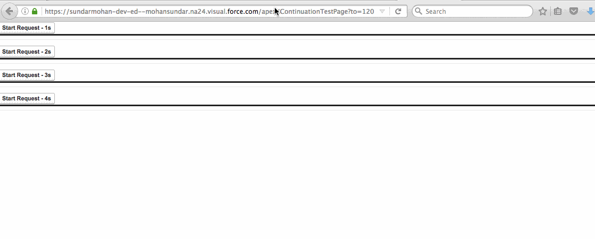

## Callout pattern selection considerations

If you are making a **sync** call to a service, here is the limits:
Number of synchronous concurrent transactions for long-running transactions that last longer than 5 seconds for each org	10

This is called 10 by 5, so 11th call in this situation will be denied.

If an org has more than **ten** transactions in flight that have been going for **five** seconds, that org is blocked from running any further Apex transaction.


Coding Pattern for Sync callout in VF action:

 - build up message payload
 - make callout  ( here thread starts running and waiting - doing nothing... until you get the response from the service)
 - examine response
 - manipulate data
 - return to the page


Reason for this is:

Sync calls are on put  separate threads: Each pod has large number of threads for this purpose. A large number, but a finite number. Because of this finite pool of threads, we have to be sure that there are always some available for the next request that shows up.


#### What I do if the call-out takes more than 5 sec in average?

If the average call-out turnaround is more than 5 sec, go async.
In async route, Salesforce use queuing to protect our resources.


#### If I have users waiting on the Visualforce page when we make call-out, what you have for this?

If you need run long-running process but the user is waiting on the VisualForce, go Continuation server route.

#### What is Continuation server route?

Continuation object holds the callout request information and the response from your callout. 

#### What is differnce between and  Continuation server route and Sync callouts?

Continuation pattern splits the sync pattern into two phases:

First: build up message payload; make callout.
 
 Separate server (Continuation server is used to make web service request). Thread is released after handling over to the Continuation Server. So threads are consumed. We store the transaction info in a serialized form and de-serialize it when we get the response back from the server.
 
Second: examine response; manipulate data; return to the page.

When we create Continuation object we put:

 - info about the call request
 - name of the method to be called (callback) when got the response

#### What the modifications done to action pattern?

To support this Continuation pattern, we have modified our action function pattern to handle call and callback pattern.

Every action function had to return a **PageReference**, which is directed back to the page.

Now with this Continuation pattern (call and callback pattern),  the action function can return a **Continuation object**, to indicate that is not-yet-ready to return to the page yet. The callback method can return a **PageReference** after handling the response from the service

#### Looks great! but what is the overhead?

Overhead involved is Continuation Object and call and callback pattern wiring

------

#### Can you provide an example of this pattern?

#### Sample usage for Salesforce Continuation Server


[Reference](https://developer.salesforce.com/docs/atlas.en-us.apexcode.meta/apexcode/apex_continuation_overview.htm?search_text=continuation%20server)

A user invokes an action on a Visualforce page that requests information from a Web service (step 1).

The app server hands the callout request to the Continuation server before returning to the Visualforce page (steps 2–3).

The Continuation server sends the request to the Web service and receives the response (steps 4–7), then hands the response back to the app server (step 8). 

Finally, the response is returned to the Visualforce page (step 9).


### Demo

#### Use case

Four serial actions calling continuation; each continuation got 3 parallel callouts; so total: 4 * 3 = 12 callouts




## Simple use 

### Visutalforce page

```xml
<apex:page controller="ContinuationController" showChat="false" showHeader="false">
   <apex:form >
      <!-- Invokes the action method when the user clicks this button. -->
      <apex:commandButton action="{!startRequest}" 
              value="Start Request" reRender="result"/> 
   </apex:form>

   <!-- This output text component displays the callout response body. -->
   <apex:outputText id="result" value="{!result}" />
</apex:page>

```
### Controller

```java

public with sharing class ContinuationController {
    // Unique label corresponding to the continuation
    public String requestLabel;
    // Result of callout
    public String result {get;set;}
    // Callout endpoint as a named credential URL 
    // or, as shown here, as the long-running service URL
    private static final String LONG_RUNNING_SERVICE_URL = 
        '<Insert your service URL>';
   
   // Action method
    public Object startRequest() {
      // Create continuation with a timeout
      Continuation con = new Continuation(40);
      // Set callback method
      con.continuationMethod='processResponse';
      
      // Create callout request
      HttpRequest req = new HttpRequest();
      req.setMethod('GET');
      req.setEndpoint(LONG_RUNNING_SERVICE_URL);
      
      // Add callout request to continuation
      this.requestLabel = con.addHttpRequest(req);
      
      // Return the continuation
      return con;  
    }
    
    // Callback method 
    public Object processResponse() {   
      // Get the response by using the unique label
      HttpResponse response = Continuation.getResponse(this.requestLabel);
      // Set the result variable that is displayed on the Visualforce page
      this.result = response.getBody();
      
      // Return null to re-render the original Visualforce page
      return null;
    }
}
```

### Limits

<table class="featureTable sort_table" summary="">
<thead class="thead sorted" align="left">
<tr>
<th class="featureTableHeader vertical-align-top " id="d16039e63">Description</th>

<th class="featureTableHeader vertical-align-top " id="d16039e66">Limit</th>

</tr>

</thead>

<tbody class="tbody">
<tr>
<td class="entry" headers="d16039e63" data-title="Description">Maximum number of parallel Apex callouts in a single
        continuation</td>

<td class="entry" headers="d16039e66" data-title="Limit">3</td>

</tr>

<tr>
<td class="entry" headers="d16039e63" data-title="Description">Maximum number of chained Apex callouts</td>

<td class="entry" headers="d16039e66" data-title="Limit">3</td>

</tr>

<tr>
<td class="entry" headers="d16039e63" data-title="Description">Maximum timeout for a single continuation<sup class="ph sup">1</sup>
</td>

<td class="entry" headers="d16039e66" data-title="Limit"><span class="ph" id="cont_timeout"><a name="cont_timeout"><!-- --></a>120 seconds</span></td>

</tr>

<tr>
<td class="entry" headers="d16039e63" data-title="Description">Maximum Visualforce controller-state
         size<sup class="ph sup">2</sup>
</td>

<td class="entry" headers="d16039e66" data-title="Limit">80 KB</td>

</tr>

<tr>
<td class="entry" headers="d16039e63" data-title="Description">Maximum HTTP response size</td>

<td class="entry" headers="d16039e66" data-title="Limit">1 MB</td>

</tr>

<tr>
<td class="entry" headers="d16039e63" data-title="Description">Maximum HTTP POST form size—the size of all keys and
values in the form<sup class="ph sup">3</sup>
</td>

<td class="entry" headers="d16039e66" data-title="Limit">1 MB</td>

</tr>

<tr>
<td class="entry" headers="d16039e63" data-title="Description">Maximum number of keys in the HTTP POST form<sup class="ph sup">3</sup>
</td>

<td class="entry" headers="d16039e66" data-title="Limit">500</td>

</tr>

</tbody>

</table>

#### References

1. [Execution Governors and Limits](https://developer.salesforce.com/docs/atlas.en-us.apexcode.meta/apexcode/apex_gov_limits.htm)

2. [Apex Callouts](https://developer.salesforce.com/blogs/engineering/2014/05/put-apex-sleep-salesforce-asynchronous-callouts.html)

3. [Integration Patterns and
Practices](https://resources.docs.salesforce.com/sfdc/pdf/integration_patterns_and_practices.pdf)
